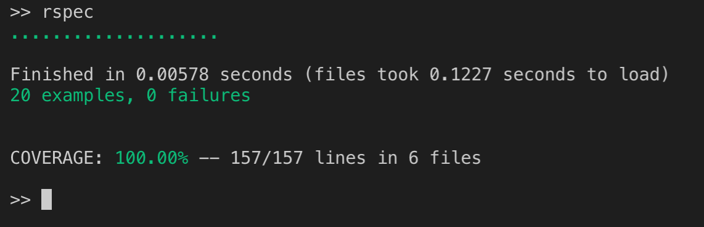
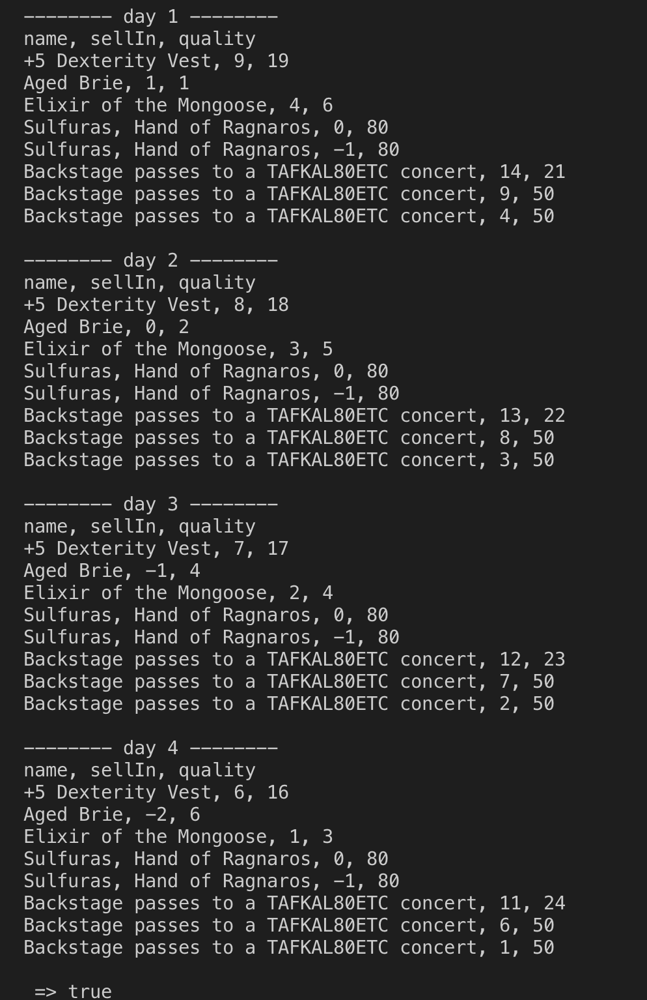
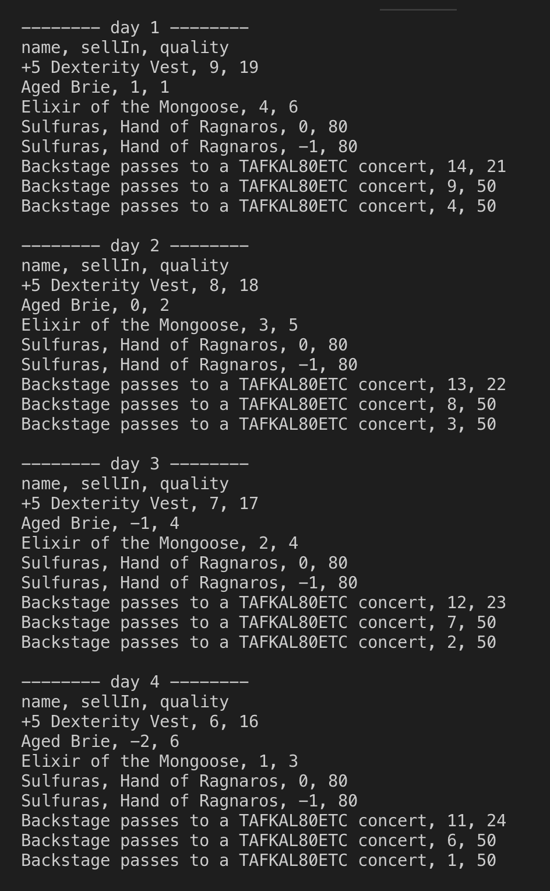
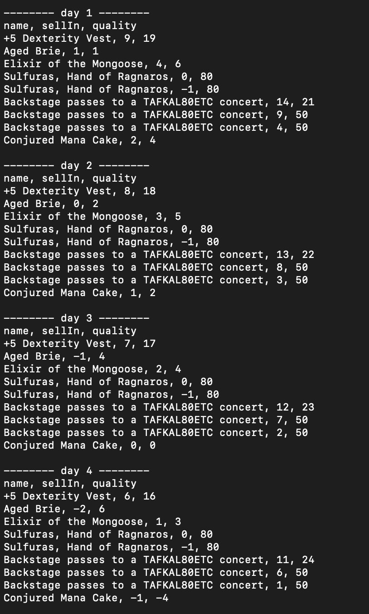

# Gilded Rose Refactoring Challenge

## Original Challenge 
#### N.B: The original challenge was written by Terry Hughes in C#. The challenge completed in this repository is a Ruby translation from Emily Bache found [here.](https://github.com/emilybache/GildedRose-Refactoring-Kata "Translated code source")

### Gilded Rose Requirements Specification
======================================

Hi and welcome to team Gilded Rose. As you know, we are a small inn with a prime location in a
prominent city ran by a friendly innkeeper named Allison. We also buy and sell only the finest goods.
Unfortunately, our goods are constantly degrading in quality as they approach their sell by date. We
have a system in place that updates our inventory for us. It was developed by a no-nonsense type named
Leeroy, who has moved on to new adventures. Your task is to add the new feature to our system so that
we can begin selling a new category of items. First an introduction to our system:

	- All items have a SellIn value which denotes the number of days we have to sell the item
	- All items have a Quality value which denotes how valuable the item is
	- At the end of each day our system lowers both values for every item

Pretty simple, right? Well this is where it gets interesting:

	- Once the sell by date has passed, Quality degrades twice as fast
	- The Quality of an item is never negative
	- "Aged Brie" actually increases in Quality the older it gets
	- The Quality of an item is never more than 50
	- "Sulfuras", being a legendary item, never has to be sold or decreases in Quality
	- "Backstage passes", like aged brie, increases in Quality as its SellIn value approaches;
	Quality increases by 2 when there are 10 days or less and by 3 when there are 5 days or less but
	Quality drops to 0 after the concert

We have recently signed a supplier of conjured items. This requires an update to our system:

	- "Conjured" items degrade in Quality twice as fast as normal items

Feel free to make any changes to the UpdateQuality method and add any new code as long as everything
still works correctly. However, do not alter the Item class or Items property as those belong to the
goblin in the corner who will insta-rage and one-shot you as he doesn't believe in shared code
ownership (you can make the UpdateQuality method and Items property static if you like, we'll cover
for you).

Just for clarification, an item can never have its Quality increase above 50, however "Sulfuras" is a
legendary item and as such its Quality is 80 and it never alters.

======================================

## Technologies
* Ruby 2.4.2
* Rspec
* Rubocop 0.56.0
* Simplecov

## How to Install and Run
```bash
> git clone git@github.com:DanielleInkster/tech_test_2.git
> bundle install
> irb
> require './lib/gilded_rose.rb'
```
### How to Run Tests
```bash
> rspec # Run the tests to ensure it works
> rubocop # Check code quality
```


======================================

## Code Quality


#### N.B - Rubocop is still flagging issues regarding guard clauses and complexity for one method. More in Reflection.

## Feature tests

### Output of Legacy Code
Legacy code can be seen [here.](https://github.com/emilybache/GildedRose-Refactoring-Kata/blob/master/ruby/gilded_rose.rb "Ruby Legacy Code")



### Output of Refactored Code


### Output of Refactored Code with Conjured Items


## Approach

This was my first attempt at refactoring legacy code and I learned a lot. While I am overall satisfied with the outcome of this project, there are things I would do differently if I were to do this again (or a similar task.)

After reading the challenge and identifying the requirements of the task, my process (in general terms) was as follows:

* Review the current code and identify how the requirements are currently being met.
* Review the output of the code found in the practice file and comparing it to the requirements (output was extended to 5 days to get a better understanding of how the code worked over time.)
* Move the Item class from the Gilded Rose model into its own model and test for functionality according to the given requirements.
* Remove the legacy code.
* Use TDD to create a refactored version of the Gilded Rose legacy code.
* Refactor the new version for Single Responsibility, using TDD to create an ItemQualityAssessor class, leaving the Gilded    	Rose class with only the updating responsibility. 

I chose to make an ItemQualityAssessor class as the requirements specified the Items class could not be changed or altered, thus I felt it was more within the parameters of the requirements to change how the items were assessed rather than making special items. 

## Reflection

While I was aware that there are several articles and videos on how to complete this challenge, I chose not to explore them until completing the project - I wanted to see how my process compared. Having now reviewed those resources and received feedback from a coach, the biggest change I would make to my process would to be to write tests for the legacy code before refactoring. This would have ensured that the program was working as expected.

I time-boxed myself to two days for this project as perfection is the enemy of completion, as well as to better mimic an actual tech test. Again, while I am overall satisfied with the results, there would be more to do if I had time. 

Given more time, I would refactor some of the logic in the ItemQualityAssessor class - Rubocop (a code quality gem for Ruby) is flagging issues with using 'if' statements rather than guard clauses and some to the logic in the concert_pass method needs to be simplified. I would also like to update my tests for mocking and stubs. 


